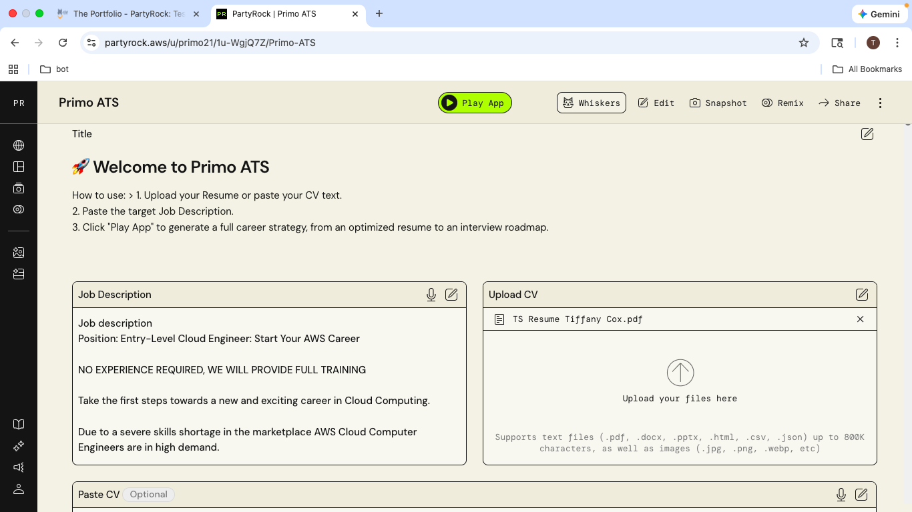
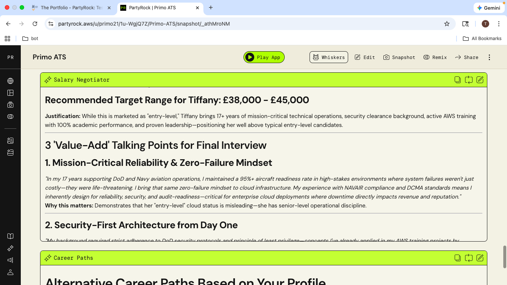
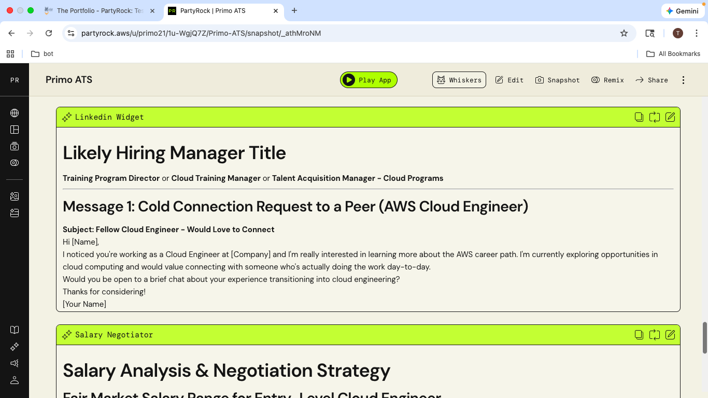
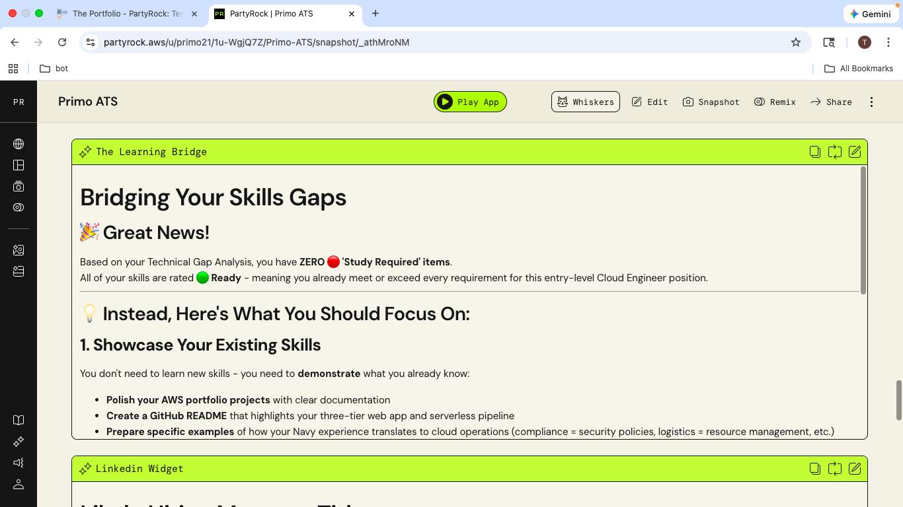
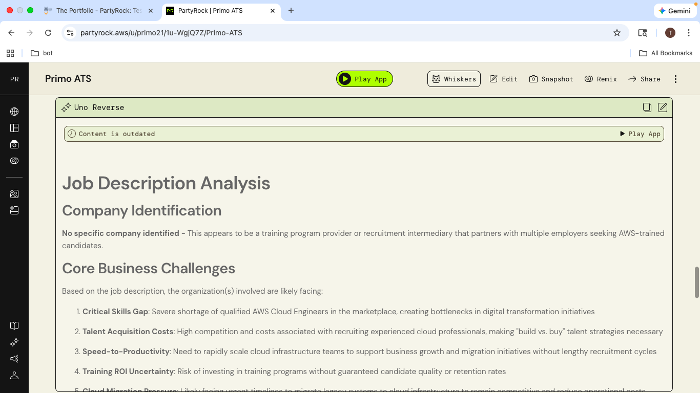
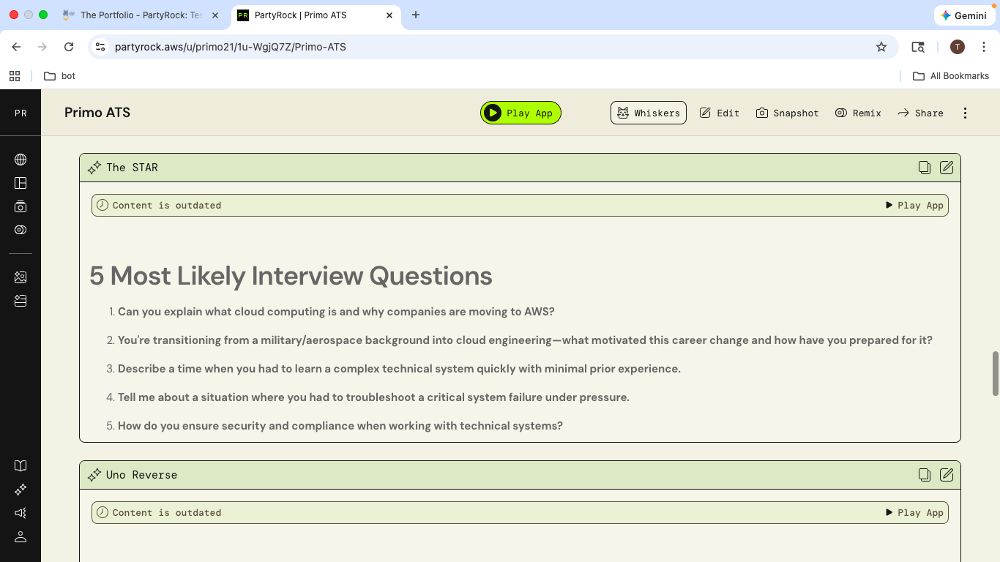
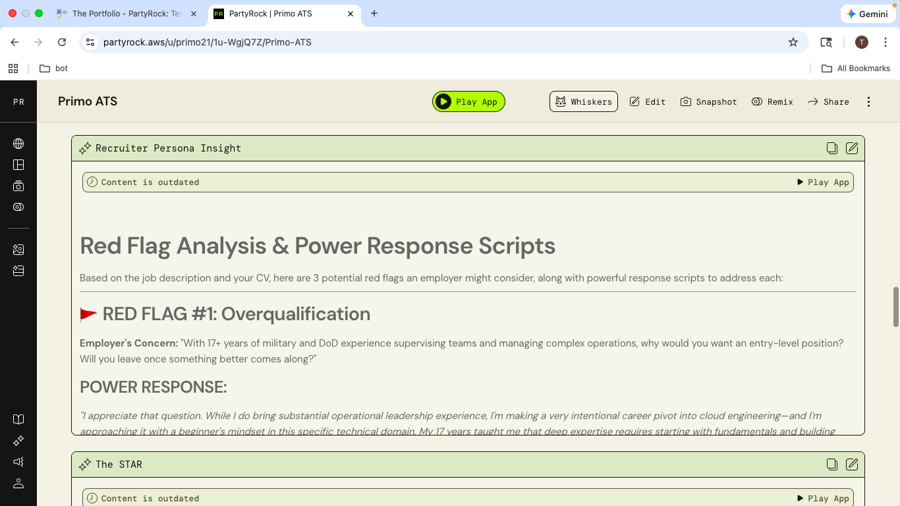
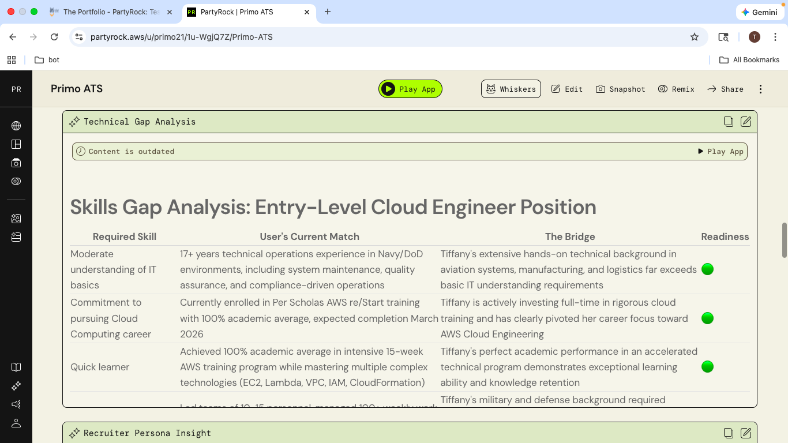
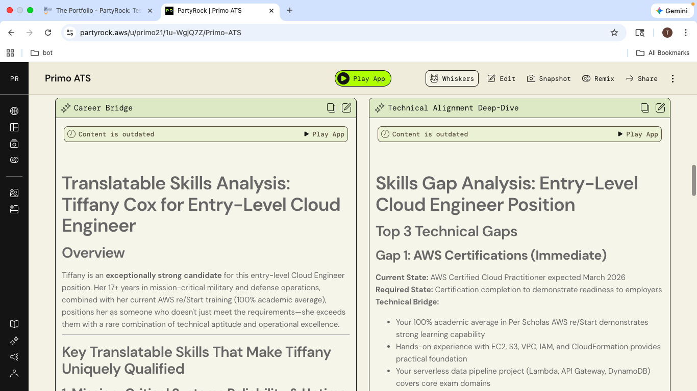
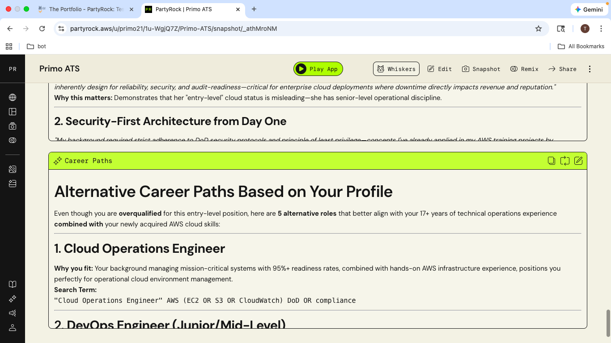

# Primo ATS: AI-Driven Career Strategy Orchestrator 🚀

**Live Demo:** [Primo ATS on AWS PartyRock](https://partyrock.aws/u/primo21/1u-WgjQ7Z/Primo-ATS) 

## 📖 Project Overview
**Primo ATS** is an end-to-end career transition engine designed to bridge the gap between a candidate's existing technical background and the specific requirements of high-level Cloud and IT roles. 

Built on **AWS PartyRock**, this application uses advanced prompt engineering to provide more than just a resume—it delivers a 360-degree career roadmap including technical gap analysis, automated STAR interview stories, and strategic business insight.

---

## 📸 Application Gallery
<table>
  <tr>
    <td> 1. Welcome & UX</td>
    <td> 2. Universal Input</td>
    <td> 3. Optimized CV (Top)</td>
  </tr>
  <tr>
    <td> 4. Optimized CV (Bottom)</td>
    <td> 5. Tailored Cover Letter</td>
    <td> 6. Translatable Skills</td>
  </tr>
    <tr>
    <td> 7. Technical Gaps</td>
    <td> 8. STAR Interviewing</td>
    <td> 9. Strategic Acumen</td>
  </tr>
  <tr>
    <td colspan="3" align="center"> 10. Alternative Career Pivot Logic</td>
  </tr>
</table>

---

## 🛠️ Key Technical Features
* **Universal Prompt Engineering:** Developed dynamic extraction logic that identifies company identity and industry challenges from any raw Job Description, ensuring the tool is vendor-agnostic.
* **Logic-First Architecture:** Refactored the application backend to move from dual-input dependency to a streamlined **Single Source of Truth (File Upload)**, resolving variable conflicts and improving User Experience (UX).
* **The "Uno Reverse" Strategy:** Built a custom logic gate that extracts core business challenges a hiring company is facing and generates strategic questions for the candidate to ask, demonstrating high-level business acumen.
* **Alternative Career Pathing:** Integrated a fail-safe career pivot logic that automatically suggests alternative job roles based on a real-time gap analysis between the CV and the target role.

## 🧰 AWS & AI Technologies
* **Generative AI:** Claude 3 (via Amazon Bedrock / PartyRock)
* **Prompt Engineering:** Multi-modal data ingestion and conditional logic gating.
* **Cloud Infrastructure:** Prototyped using AWS PartyRock's low-code environment.

---
*Developed as part of the AWS re/Start program to demonstrate the practical application of Generative AI in career development.*
